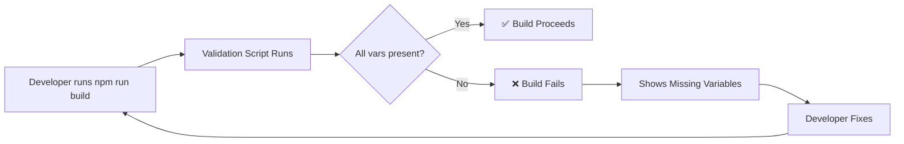
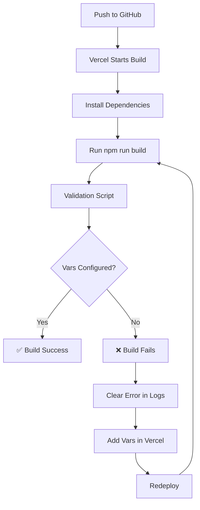

# Environment Variable Validation - Implementation Complete ✅

## 🎯 Problem Solved

Previously, the app could deploy successfully to Vercel but show a **404 error** if environment variables were missing. Users wouldn't know what was wrong until after deployment.

Now, the app **validates environment variables at multiple stages** and provides clear error messages to guide users to the solution.

---

## 🛡️ Protection Layers Implemented

### 1. **Build-Time Validation** ⚡
**File:** `scripts/validate-env.js`

- Runs **automatically before every build**
- Checks all required environment variables
- **Fails the build** if any are missing
- Shows exactly which variables are missing
- Provides step-by-step instructions to fix

**Usage:**
```bash
npm run build          # Auto-validates then builds
npm run validate-env   # Manual validation check
```

**Example Output:**
```
🔍 Validating environment variables...

📋 Required Variables:
  ✅ NEXT_PUBLIC_SUPABASE_URL - Set (https://htd...okc)
  ✅ NEXT_PUBLIC_SUPABASE_ANON_KEY - Set (eyJhbGci...ATk)
  ✅ GEMINI_API_KEY - Set (AIzaSyC...4oE)

📋 Optional Variables:
  ✅ NEXT_PUBLIC_SUPPORT_WHATSAPP - Set

✅ All required environment variables are present!
```

**If variables are missing:**
```
❌ VALIDATION FAILED!

Missing required environment variables.

For Vercel deployment:
  1. Go to: https://vercel.com/[your-project]/settings/environment-variables
  2. Add all required variables
  3. Make sure to check all environments (Production, Preview, Development)
  4. Redeploy after adding variables
```

### 2. **Runtime Validation** 🔄
**File:** `src/lib/validateEnv.ts`

Utility functions for validating environment variables in your code:

```typescript
import { validateClientEnv, getRequiredEnv, isEnvConfigured } from '@/lib/validateEnv';

// Validate all client variables
validateClientEnv();

// Get a specific required variable
const apiKey = getRequiredEnv('GEMINI_API_KEY');

// Check if env is configured (non-throwing)
if (!isEnvConfigured()) {
  // Show user-friendly error
}
```

### 3. **Enhanced Error Messages** 💬
**File:** `src/lib/supabase.ts`

Updated Supabase initialization to show:
- **Clear console errors** with variable names
- **User-friendly messages** instead of cryptic errors
- **Actionable instructions** on how to fix

### 4. **Comprehensive Documentation** 📚
**File:** `docs/ENVIRONMENT_SETUP.md`

Complete guide covering:
- What each variable does
- Where to get credentials
- Local development setup
- Vercel deployment steps
- Troubleshooting common issues
- Security best practices

### 5. **Improved .env.example** 📝
**File:** `.env.example`

Enhanced template with:
- Detailed comments for each variable
- Links to where to get credentials
- Format examples
- Clear sections (required vs optional)
- Instructions for local and production use

---

## 📋 New NPM Scripts

```json
{
  "scripts": {
    "build": "node scripts/validate-env.js && next build",
    "build:skip-validation": "next build",
    "validate-env": "node scripts/validate-env.js"
  }
}
```

- **`npm run build`** - Validates env vars, then builds (default)
- **`npm run build:skip-validation`** - Skips validation (emergency use only)
- **`npm run validate-env`** - Manual validation check

---

## 🚀 How It Works

### Development Workflow



### Vercel Deployment Flow



---

## ✅ Benefits

### 1. **Fail Fast**
- Catch configuration errors **before deployment**
- Save time by not waiting for full deployment to discover issues

### 2. **Clear Guidance**
- Specific error messages tell you **exactly** what's missing
- Step-by-step instructions on how to fix
- Links to relevant documentation

### 3. **Multiple Safety Nets**
- Build-time validation (CI/CD)
- Runtime validation (application code)
- Manual validation (npm script)

### 4. **Better Developer Experience**
- New developers can easily set up the project
- Clear documentation reduces support requests
- Automated checks prevent common mistakes

### 5. **Production Safety**
- Impossible to deploy without required configuration
- Prevents 404 errors from missing environment variables
- Reduces debugging time in production

---

## 🧪 Testing

### Test Build-Time Validation

```bash
# Remove an env var temporarily
unset NEXT_PUBLIC_SUPABASE_URL

# Try to build
npm run build

# Should see:
# ❌ NEXT_PUBLIC_SUPABASE_URL - MISSING (REQUIRED)
# Build exits with error code 1
```

### Test Runtime Validation

```typescript
import { validateClientEnv } from '@/lib/validateEnv';

try {
  validateClientEnv();
  console.log('✅ Environment configured');
} catch (error) {
  console.error('❌ Missing variables:', error.message);
}
```

### Test Manual Validation

```bash
npm run validate-env
```

---

## 📊 Files Changed

| File | Status | Description |
|------|--------|-------------|
| `scripts/validate-env.js` | ✨ New | Build-time validation script |
| `src/lib/validateEnv.ts` | ✨ New | Runtime validation utilities |
| `docs/ENVIRONMENT_SETUP.md` | ✨ New | Comprehensive setup guide |
| `.env.example` | 📝 Updated | Enhanced with documentation |
| `package.json` | 📝 Updated | Added validation scripts |
| `src/lib/supabase.ts` | 📝 Updated | Better error messages |

---

## 🔜 Future Enhancements

Potential improvements:
1. **Type-safe environment variables** with Zod schema validation
2. **GitHub Actions** workflow to validate on PR
3. **Vercel Integration** to auto-check env vars before deployment
4. **Environment variable sync** tool for team members
5. **Encrypted secrets** management for sensitive values

---

## 📞 Usage Examples

### For New Developers

```bash
# 1. Clone the repo
git clone https://github.com/JacquelineGrecco/base-coach.git
cd base-coach

# 2. Install dependencies
npm install

# 3. Set up environment
cp .env.example .env.local
# Edit .env.local with your values

# 4. Validate configuration
npm run validate-env

# 5. Start development
npm run dev
```

### For Vercel Deployment

1. Push code to GitHub
2. Connect to Vercel
3. **Before first deployment:** Add environment variables in Vercel settings
4. Deploy - validation will ensure everything is configured
5. If build fails, check logs for specific missing variables

---

## 🎓 Key Takeaway

**Before this implementation:**
- ❌ App deploys successfully but shows 404
- ❌ No indication of what's wrong
- ❌ Manual debugging required

**After this implementation:**
- ✅ Build fails with clear error if vars missing
- ✅ Exact variable names shown in error
- ✅ Step-by-step fix instructions provided
- ✅ Multiple validation layers for safety

---

## 📚 Documentation Links

- **Setup Guide:** [`docs/ENVIRONMENT_SETUP.md`](docs/ENVIRONMENT_SETUP.md)
- **Environment Template:** [`.env.example`](.env.example)
- **Validation Script:** [`scripts/validate-env.js`](scripts/validate-env.js)
- **Runtime Utils:** [`src/lib/validateEnv.ts`](src/lib/validateEnv.ts)

---

**Commit:** `4462b4a`  
**Date:** December 22, 2025  
**Status:** ✅ **COMPLETE AND DEPLOYED**

